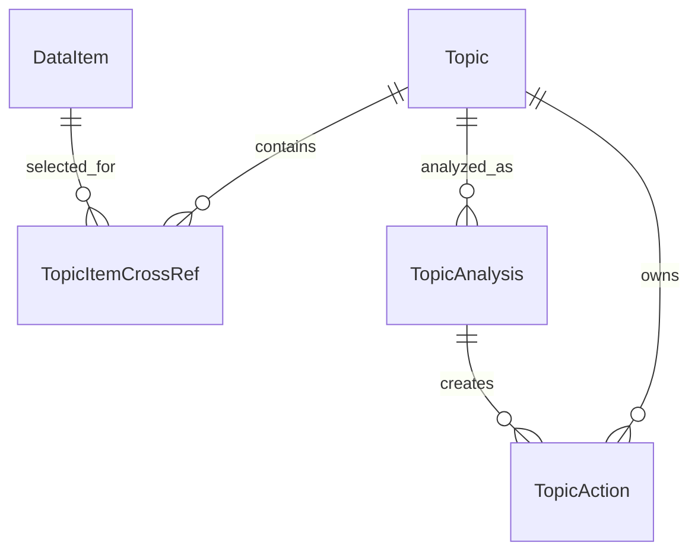

# SmartClipboardAI 아키텍처

## 기준 구조

SmartClipboardAI는 Kotlin + Jetpack Compose 기반 Android 앱입니다. 현재 코드는 MVVM에 가까운 구조로 나뉘어 있습니다.

- `domain`: 앱의 핵심 모델과 repository interface
- `data`: Room entity, DAO, repository 구현, Android data source
- `presentation`: Activity, ViewModel, Compose 화면
- `di`: Hilt module과 dispatcher 주입
- `ui/theme`: One UI inspired theme

## MVVM 기반 역할

- Activity는 Android lifecycle, permission launcher, intent 진입점을 담당합니다.
- ViewModel은 UI 상태와 사용자 intent를 처리합니다.
- Repository는 데이터 저장/조회와 주요 use case의 중심 facade 역할을 합니다.
- DataSource/Handler는 Android API와 직접 맞닿은 기능을 담당합니다.
- Compose 화면은 상태를 렌더링하고 event를 ViewModel intent로 전달합니다.

## DataRepository 중심 데이터 흐름

현재 `DataRepository`는 모든 데이터 흐름의 중심입니다.

주요 역할:

- `DataItem` 관찰 및 추가
- Share/Tile/MediaStore로 들어온 데이터 저장
- Topic 생성 및 DataItem 연결
- TopicAnalysis 생성
- TopicAction 초안 생성
- AiProposal 관찰 및 생성

현재 `DataRepositoryImpl`은 너무 많은 책임을 가지고 있으므로, 이후 작업에서는 기능별 collaborator로 분리하는 방향이 좋습니다. 단, 기존 구현을 바로 버리지 않고 안정적인 facade로 유지하면서 내부를 점진적으로 정리합니다.

## 모델 관계

### DataItem / DataItemEntity

모든 수집 데이터의 기본 단위입니다. MVP에서는 cluster 정보를 `DataItem`과 `DataItemEntity` 필드로 추가합니다.

### Topic

사용자가 확정한 작업 주제입니다. AI 추천은 보조일 뿐 최종 Topic 생성은 사용자 승인 후 일어납니다.

### TopicAnalysis

Topic과 연결된 자료를 분석한 결과입니다.

### TopicAction

실행 명령이 아니라 사용자가 검토할 수 있는 초안입니다.

## 기술별 역할 분리

### Room

- `DataItemEntity`, `TopicEntity`, `TopicAnalysisEntity`, `TopicActionEntity` 저장
- migration은 공통 기반 작업으로 순차 처리
- DB schema 변경은 사전 승인 필요

### Hilt

- Repository, Handler, DataSource, CoroutineDispatcher 주입
- 새 Manager/Processor 추가 시 module 변경 충돌에 주의

### Coroutines

- Room, MediaStore, 파일 복사, OG tag 추출, Gemini 호출은 IO dispatcher에서 실행
- UI 상태 업데이트는 ViewModel scope에서 처리

### Compose

- 화면은 가능한 작은 단위 composable로 분리
- 현재 `MainScreen.kt`는 크기가 커서 UX 재설계 task에서 단계적으로 분리

## Android 컴포넌트 역할

### MainActivity

앱의 메인 진입점입니다. 현재 Media 권한 요청, 초기 screenshot import trigger, handoff launcher 연결을 담당합니다.

### ShareReceiverActivity

Android Share Sheet에서 선택되었을 때 실행됩니다. 링크/텍스트/이미지/파일을 받아 저장 피드백을 보여줍니다.

### ClipboardCaptureTileService

Quick Settings Tile entry입니다. Tile 자체에서 클립보드를 읽지 않고 `ClipboardCaptureActivity`를 엽니다.

### ClipboardCaptureActivity

투명 Activity 역할을 합니다. 포커스를 얻은 뒤 가장 최근 Primary Clip을 읽어 저장합니다.

### TransparentActivity

현재 별도 이름의 `TransparentActivity` 클래스는 없고, `ShareReceiverActivity`와 `ClipboardCaptureActivity`가 투명 theme을 사용해 해당 역할을 수행합니다.

## 현재 재사용 가능한 코드

- `DataRepository` / `DataRepositoryImpl`: 중앙 흐름 facade로 재사용
- `AndroidShareContentHandler`: Share Target 처리 기반으로 재사용
- `DefaultClipboardCaptureHandler`: Tile 기반 clipboard 저장 기반으로 재사용
- `AndroidMediaStoreDataSource`: MediaStore query 기반으로 재사용
- `DefaultMediaImportHandler`: 중복 방지와 screenshot 판별 일부 재사용
- `Topic` / `TopicAnalysis` / `TopicAction` 모델: README와 맞으므로 유지
- `HandoffDraftFormatter` / `HandoffLauncher`: 공유 초안과 Calendar draft 초기 기반으로 재사용
- `SmartClipboardTheme`: One UI inspired 팔레트 유지

## 아직 없는 클래스와 재사용 가능성

검색 결과 현재 코드에는 아래 클래스 계열이 실제 구현되어 있지 않습니다.

- `OCRProcessor`
- `WebExtractor`
- `GeminiManager`
- `DynamicClusterManager`
- `DbscanClusterManager`
- 기타 `ClusterManager`

문서3에는 아이디어로 등장하지만 현재 레포 파일에는 없습니다. 따라서 이후 task에서 새로 추가하되, 기존 `domain/ai`, `data/ai`, `data/source/media`, `DataRepository` 구조와 충돌하지 않게 계약부터 정의해야 합니다.

## 충돌 위험과 작업 순서

공통 모델, DB, Repository, Navigation, Theme, Manifest, Gradle은 충돌 위험이 큽니다. 아래 순서로 처리합니다.

1. 문서와 task 상태 체계 확정
2. 현재 코드 감사
3. DataItem cluster 필드와 Room migration
4. Navigation/Main 화면 구조 baseline
5. Permission/Manifest baseline
6. 독립 feature task 병렬화

이 순서를 지키지 않으면 여러 개발자가 같은 파일을 동시에 수정할 가능성이 큽니다.
